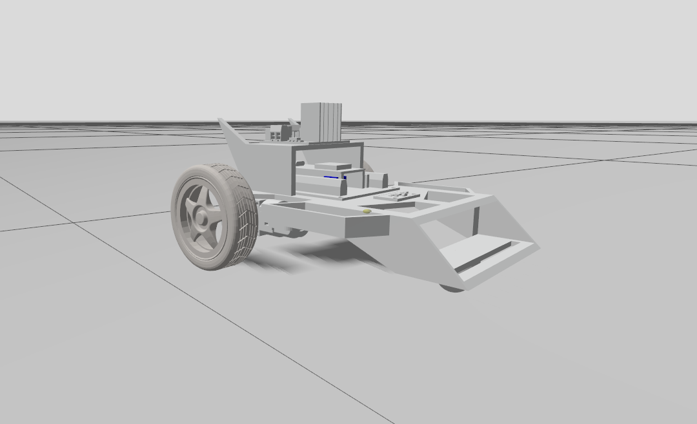
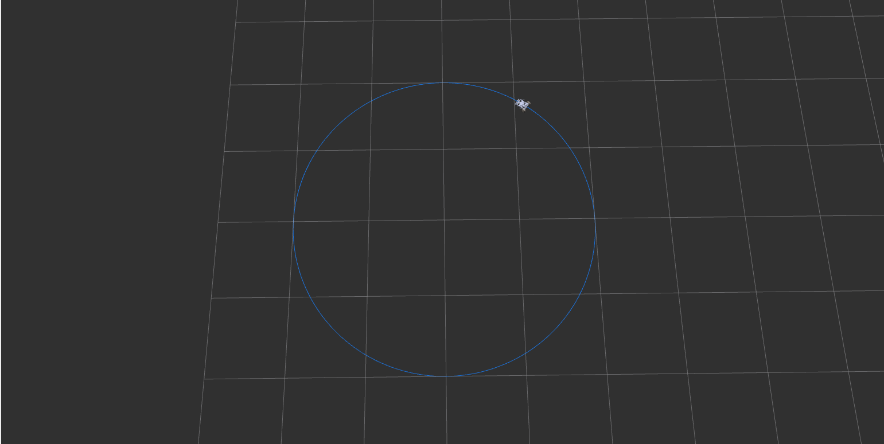
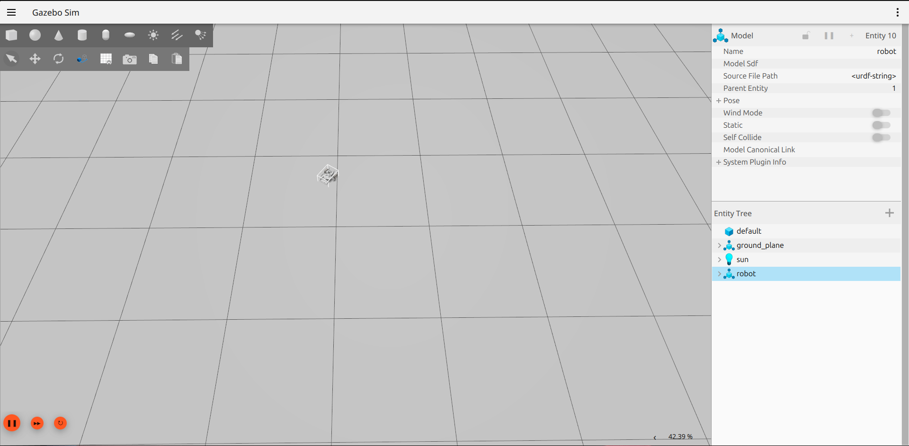

# Differential Robot Simulation

Simple differential drive robot simulation using ROS 2, Gazebo, and RViz2.

---

# Prerequisites

* Ubuntu 24.04
* ROS 2 Jazzy Jalisco
* Python 3.12
* Gazebo Harmonic
* RViz2

---

# Installation & Build

## Create Workspace

```bash
mkdir -p ~/robot_ws
cd ~/robot_ws
```

## Clone Repository

```bash
git clone https://github.com/Akmal-0/differential-robot-simulation.git
```

## Build Workspace

```bash
cd ~/robot_ws
colcon build
```

## Source Workspace

```bash
source install/setup.bash
```

---

# Run Simulation

```bash
ros2 launch robot robot_launch.py
```

Open in another terminal :
```bash
ros2 topic pub --once /cmd_vel geometry_msgs/msg/Twist "{linear: {x: 0.5}, angular: {z: 0.3}}"
```
---

# Features

* Differential drive robot simulation
* Gazebo Harmonic integration
* RViz2 visualization
* ROS 2 Jazzy support
* URDF robot model
* `/cmd_vel` velocity control
* Keyboard teleoperation support

# Result

## Preview

<p align="center">
  
</p>

## RViz2

<p align="center">
  
</p>

## Gazebo

<p align="center">
  
</p>
